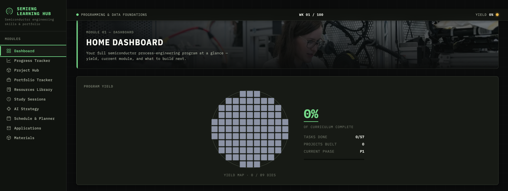

# Semiconductor Engineering — Learning Hub

A single-file, self-hosted learning dashboard for a complete self-directed program in **semiconductor process engineering** which includes an optional built-in AI coach and an explicit strategy for using AI to learn *faster without learning less*.

No install. No backend. No account. Download one HTML file, open it in your browser, and start.

## Why this exists

I'm teaching myself semiconductor process engineering, and I wanted more than a folder of bookmarks. I wanted a system that:

- Tracks progress across a multi-phase curriculum the way a fab tracks **yield**
- Turns study time into **portfolio projects** hiring managers can actually see
- Uses AI as a **learning multiplier** — with written rules for when to use it and, just as importantly, when not to

So I built one. If you're starting a similar journey, fork it and make it yours.

## What's inside

**10 modules, one file:**

1. **Dashboard:** program "yield," current phase, and what to build next
2. **Progress Tracker:**  every phase, track, and task with completion state
3. **Project Hub:**  the build projects that do the signaling work
4. **Portfolio Tracker:** the interview flagships
5. **Resources Library:**  curated books, courses, docs, and channels per phase
6. **Study Session Launcher:**  focused sessions with AI-generated plans and quizzes
7. **AI Strategy:**  my playbook for AI-assisted learning (more below)
8. **Schedule & Planner:** week-by-week plan and career milestones
9. **Applications & STAR Bank:**  role tracking and interview story bank
10. **Materials & Costs:** parts and kits for the hands-on builds

**The curriculum** runs through six phases:

| Phase | Focus |
|---|---|
| 1 | Programming & Data (Python, pandas, SPC, statistics) |
| 2 | Control & Instrumentation (PID, signals, sensors, Arduino) |
| 3 | Industrial & Equipment (PLC, SCADA, SECS/GEM, OPC-UA) |
| 4 | Smart Manufacturing, ML & Robotics (OpenCV, YOLO, scikit-learn, FastAPI, ROS 2) |
| 5 | Process Engineering depth (deposition, etch, DOE, endpoint analysis) |
| 6 | Capstone — a benchtop process-tool simulator |

Progress, notes, and settings persist in your browser's local storage, and you can export/import everything as a file.

## The AI Strategy module

This is the part I'm most opinionated about. AI can accelerate learning or quietly replace it, so the hub includes a written playbook of use cases with rules, for example:

- **Concept scaffolding:**  AI explains, *I* re-derive
- **Feynman Technique enforcer:** I explain the concept; AI attacks the gaps
- **Active recall quiz generation:**  AI writes the quiz *after* I study, not instead of it
- **Code review with learning intent:**  AI reviews my code and must explain *why*, not just fix
- **Rubber-duck debugging (upgraded):**  I narrate my reasoning first, then compare
- **AI justification review:** before using an AI answer in real work, I have to be able to defend it

The rule of thumb throughout: **AI drafts, I verify. AI quizzes, I recall. AI accelerates, I understand.**

## Getting started

1. Download `learning-hub.html`
2. Open it in any modern browser 
3. *(Optional)* Add an Anthropic API key from [console.anthropic.com](https://console.anthropic.com) to enable the AI coach, study plans, and report grading. You can also skip this — everything else works without it.

> ⚠️ **Security note:** if you add an API key, it is stored **in plain text in your browser's local storage**. Never share, commit, or host the file while a key is saved, use a key with a spending limit, and revoke it if in doubt.

## Make it yours

The whole program  phases, tracks, tasks, resources, milestones is defined as data inside the file. Fork the repo, edit the curriculum objects, and you have a learning hub for *your* field: a different engineering discipline, a language, a certification path, anything with phases and projects.

## Roadmap

- [ ] Finish Phase 1 and publish the first portfolio project (instrument data logger)
- [ ] SPC dashboard build
- [ ] First SECS/GEM simulated tool interface
- [ ] Automated defect inspector

Follow along — I'm building this in public.

## License

MIT — use it, fork it, rebuild it for your own journey.
