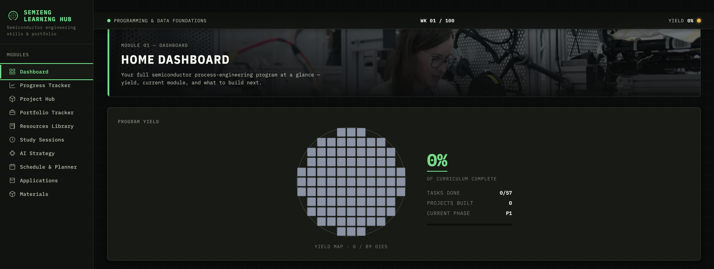

# Engineering Learning Hub

A single-file, self-hosted learning dashboard for a self-directed **4-month, 16-week program**
into manufacturing, process, or applications engineering roles, with a built-in AI coach and an
explicit strategy for using AI to do the job faster, not to replace the engineer doing it.

No install. No backend. No account. Download one HTML file, open it in your browser, and start.

## Why this exists

I wanted more than a folder of bookmarks for building the skills a manufacturing, process, or
applications engineer actually needs on the job. I wanted a system that:

- Tracks progress across a real curriculum the way a plant tracks a KPI, phase by phase, week by week
- Turns study time into **portfolio deliverables** a hiring manager can actually see: dashboards,
  automated reports, DMAIC projects, templates
- Uses AI as **leverage on top of engineering judgment**, never a replacement for it, with written
  rules for when to use it and when not to
- Adapts to whoever's using it: your target role and background drive the AI coach and every
  generated prompt, not a fixed industry

So I built one. If you're starting a similar journey, fork it and make it yours.

## What's inside

**10 modules, one file:**

1. **Dashboard:** program status at a glance, current phase, and what to build next
2. **Progress Tracker:** every phase, track, and task with completion state
3. **Project Hub:** the build projects that do the signaling work
4. **Portfolio Tracker:** the interview flagships
5. **Resources Library:** curated references and courses per phase
6. **Study Session Launcher:** focused sessions with AI-generated plans and quizzes
7. **AI Strategy:** the playbook for AI-assisted engineering work (more below)
8. **Schedule & Planner:** week-by-week plan and monthly milestones
9. **Applications & STAR Bank:** role tracking and interview story bank
10. **Materials & Costs:** software and tooling costs for the program

**The curriculum** runs 4 months, one phase per month, each ending in a real deliverable:

| Phase | Focus | Primary tools |
| --- | --- | --- |
| 1 | Lean Six Sigma core & process mapping, AI-assisted data handling | JMP, SQL, Excel |
| 2 | Root cause & FMEA with AI, automating repetitive engineering tasks | JMP, Python, SQL, Power BI |
| 3 | Process documentation with AI quality gates, applications engineering fundamentals | Excel, AI |
| 4 | End-to-end DMAIC capstone, portfolio & interview readiness | JMP, SQL, Python, Power BI |

Lean Six Sigma, DMAIC, root cause, SPC, process capability, FMEA, is the engineering foundation
throughout. AI sits on top of it: building dashboards, automating repetitive reporting, and
creating templates that make sure work is complete and correct before it goes out.

Progress, notes, and settings persist in your browser's local storage, and you can export/import
everything as a file.

## The AI Strategy module

This is the part I'm most opinionated about. AI can make an engineer faster and more consistent,
or it can quietly make decisions it has no business making, so the hub includes a written playbook
of use cases with rules, for example:

- **Dashboards, not decisions:** AI helps build the dashboard; the engineer decides what it means
- **Automation with a human check:** AI drafts the script that automates a recurring report; the
  engineer verifies it before it runs unattended
- **Templates that catch gaps:** AI-generated checklists and completeness checks, used to review
  work, not to approve it
- **AI justification review:** before using AI-generated output in real work, you have to be able
  to defend it in your own words

The rule of thumb throughout: **AI drafts and checks, the engineer verifies and owns the result.**

## Getting started

1. Download `learning-hub.html`
2. Open it in any modern browser
3. *(Optional)* Add an Anthropic API key from [console.anthropic.com](https://console.anthropic.com)
   to enable the AI coach, study plans, and report grading. You can also skip this, everything
   else works without it.

> ⚠️ **Security note:** if you add an API key, it is stored **in plain text in your browser's local
> storage**. Never share, commit, or host the file while a key is saved, use a key with a spending
> limit, and revoke it if in doubt.

## Make it yours

The whole program, phases, tracks, tasks, resources, milestones, is defined as data inside the
file. Fork the repo, edit the curriculum objects, and you have a learning hub for *your* field:
a different engineering discipline, a certification path, anything with phases and projects.

## Roadmap

- [ ] Finish Month 1 and publish the first deliverable (DMAIC charter + baseline dashboard)
- [ ] Automated recurring-report generator
- [ ] AI-assisted FMEA package
- [ ] Capstone DMAIC project, published

Follow along, I'm building this in public.

## License

MIT, use it, fork it, rebuild it for your own journey.
